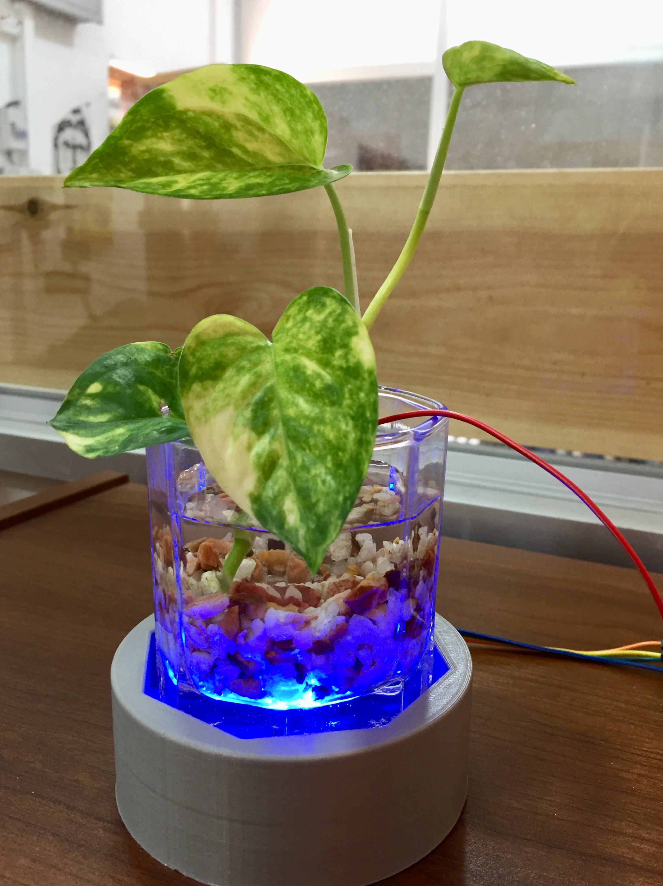

# Touch Sensitive Plant

We will learn how to build a touch-based color-changing plant using Arduino. When you touch the plant, the color of the plant vase will automatically change. This is a nice indoor decorative project and also a small hobby project for beginners to build and learn some interesting stuff.

**Author**
 * Jathujan Mahendran , maker at Dream Space Academy.

**Acknowledgment**
 * Jerushan Sritharan , Guardian of Electronics Lab, Dream Space Academy.
 * Rat

https://user-images.githubusercontent.com/81843643/128168873-04116989-047b-404d-9dbd-5ab0898b4210.MOV

hees Koneswaran , maker at Dream Space Academy. 
 * Sajeev Punithakaran , maker at Dream Space Academy.
  

## How to Detect a Touch on the Plant?

 Our plant circuit is also based on the capacitive touch sensor. That is we will connect a wire to our plant to make it act like an electrode, then when we touch the plant, due to the presence of our body, the capacitance changes and this will be detected by our circuit. And talking about the circuit, we need a microcontroller to detect the change in capacitance and also control the whole system. In our case, the microcontroller is Arduino. 

## Materials Needed
* Arduino
* Common cathode RGB LED
* 1 megohm resistor (brown, black, green)
* Connecting wire
* A plant with  its base
* Common PCB
* Circuit Diagram 

## Steps

- First, connect the one mega ohm resistor in between Arduino pin 2 and pin 4. 
- Then connect a long wire (copper) to pin 4. This wire acts as an electrode or touch lead, then connects RGB led common ground to ground and red to D5 of Arduino and green to D6, blue to D7.
- finally, attach the wire to the plant body and that's it 

 
## Arduino Program 

 

To detect the capacitance of the plant, we need to use a capacitive sensor library. 
After downloading and adding the library to your Arduino IDE, include that library in your code. This library helps to read the capacitance of Arduino pins.

 
We have already connected the resistor between pin 2 and 4, so we need to measure the capacitance in pin 4, for that, defined the pins.

 
capacitive sensor toggles a microcontroller pin, that is it sends the pin to a new state and then waits for the receive pin to change to the same state as the send pin. In the setup section, I defined different pins for led and sensor lead.

 
Each time a touch is detected, it will increase the counts and I have given different conditions to light up in different colors based on the incremented number.

